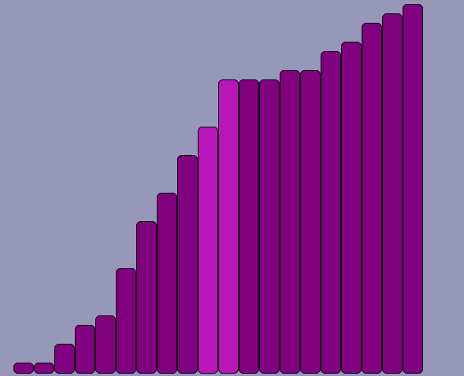
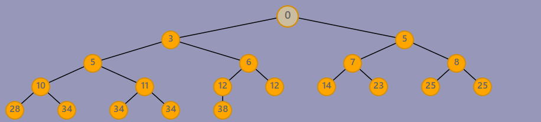

## Search-Visualizer
React app excercise to show search algorithms
This project was bootstrapped with [Create React App](https://github.com/facebook/create-react-app).

# Try it in stackblitz

## Available Algorithms
Algorithm | `STABLE` | `IN LOCO` | `Complexity`
--- | :---: | :---: | :---:
`BubbleSort` | &#x2713; | &#x2713; |  $ O(n^2) $
`HeapSort` | &#x2713; | &cross; |  $ O(nlog_2n) $
`QuickSort` | &#x2713; | &cross; |  $ \approx O(nlog_2n) $
`InsertionSort` | &#x2713; | &#x2713; | $ O(n^2) $
`TimSort` | &#x2713; | &#x2713; |  $ O(nlog_2n) $
`MergeSort` |  &#x2713;  |  &#x2713; |  $ O(nlog_2n) $
`BinarySearch` | - | - | $ O(log_2n) $

In the project directory, you can run:
## Version 2
Heapsort is now displayed as a binary tree

### `npm start`

Runs the app in the development mode.\
Open [http://localhost:3000](http://localhost:3000) to view it in the browser.

The page will reload if you make edits.\
You will also see any lint errors in the console.

## Learn More

You can learn more in the [Create React App documentation](https://facebook.github.io/create-react-app/docs/getting-started).

To learn React, check out the [React documentation](https://reactjs.org/).
